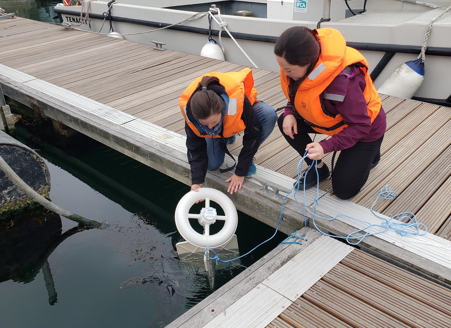
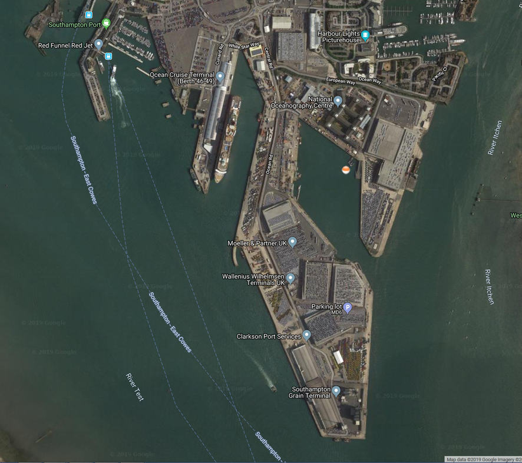

Before we deploy a large number of drifters near the Greenland shelf-break, we wanted to do a dry run (or rather a wet run) locally. This will allow us to see how they react to near-real environment (sea water, clear or cloudy sky, obstacles blocking the GPS signal and so on), and give us some experience in their deployment in controlled conditions. To that end, we ‘deployed’ one of the surface drifters and tied it off to the NOC pontoon facility.
 
The instrument's type is CARTHE and it was developed by the University of Miami for wide use in large-scale research on the surface ocean circulation.  In contrast to standard drifters it is made of biodegradable plastic (PHA). However, we’d prefer that it not fall apart before a few months of operation (we need 6 months endurance).
 
After the magnet was detached, the device immediately started to transmit its geographical position with use of GPS system. The location data are sent every three hours and they may be accessed and downloaded from the Pacific Gyre website for further analysis and visualisation.
 
The immersing operation was conducted on Friday 17 May under great weather conditions and was completed with overall success. Below you can see some photos from the operation and the map of deployment (the drifter is marked as a white-orange buoy).

