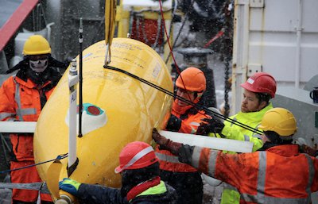

## Synopsis:

During the last three decades, the Antarctic Botttom Water (AABW) filling the bulk of the global ocean abyss has exhibited a striking warming and contraction in volume over much of the world ocean, particularly in the Atlantic basin. While the causes of these changes are unknown, available evidence suggests that, in the Atlantic Ocean, the warming and contraction of AABW may be caused by changes in winds over the northern Weddell Sea, where much AABW is produced. This hypothesis asserts that those winds regulate the volume and temperature of the AABW exported northward via the Orkney Passage (a major AABW exit route from the Weddell Sea) by altering the intensity of the turbulent mixing between AABW and overlying warmer waters in the passage.

In DynOPO, we set out to test and, if necessary, redefine this hypothesis by:

(1) carrying out the first systematic measurements of how AABW flows through the Orkney Passage, how its properties change along the way, and what processes are important in determining the AABW flow and transformation in the passage;

(2) determining how and why the flux and properties of AABW in the Orkney Passage respond to wind forcing on time scales of up to several years.

To address task (1) above, we will measure the velocity and properties of AABW and the intensity of turbulent mixing at several key locations in the passage. The observations will be obtained both with instruments lowered to the seabed from a ship and with a novel autonomous underwater vehicle, which is particularly effective at measuring a range of potentially crucial processes occurring near the ocean floor. To address task (2), we will enhance an array of moorings recently deployed in the Orkney Passage by the British Antarctic Survey to monitor the flux and properties of AABW. We will equip the moorings with sufficient oceanographic instrumentation to identify the processes determining the AABW’s response to wind forcing, which are not resolved by the present array.

We will use our findings from tasks (1) and (2) to define how and why the volume and properties of the AABW escaping the Weddell Sea through the Orkney Passage react to changes in winds. Armed with this new understanding, we will revisit the widespread AABW warming and contraction observed over recent decades, and inform the international strategy to monitor future changes in AABW circulation.

## Funding

- PI: Alberto Naveira Garabato, Eleanor Frajka-Williams (University of Southampton), UKRI Grant Reference [NE/K013181/1](https://gtr.ukri.org/projects?ref=NE%2FK013181%2F1)

- PI: Mike Meredith, E. Povl Abrahamsen, Keith Nicholls (British Antarctic Survey), UKRI Grant Reference [NE/K012843/1](https://gtr.ukri.org/projects?ref=NE%2FK012843%2F1)

## News

Most exciting, perhaps, is that Boaty McBoatface and the DynOPO project appeared on CBBC Newsround on 30 June 2017, which is a news programme for kids produced daily by the BBC. You can watch that clip at [Newsround, 30 June 2017](http://www.bbc.co.uk/newsround/38949047).

**28 June 2017**

The DynOPO project and successful missions of Autosub Long Range got a bit of coverage in the news today, with articles in the BBC, the Guardian, and press releases on the University of Southampton webpage and the NERC website.

For UK Robotics week (26–30 June 2017), the University of Southampton released a press item about the return of Boaty. This got picked up by a number of news outlets, and can be found at:

- [Southampton press release](http://www.southampton.ac.uk/news/2017/06/boaty-comes-home.page) — including the animated fly-through
- [NERC website](http://www.nerc.ac.uk/press/releases/2017/14-boaty/?utm_medium=social&utm_campaign=SocialSignIn&utm_source=Twitter)
- [BBC website](http://www.bbc.co.uk/news/science-environment-40425996) — including the animated fly-through
- [CBBC Newsround](http://www.bbc.co.uk/newsround/38949047) — children’s news programme with a few seconds of the animated fly-through and a description of the DynOPO project
- [Guardian](https://www.theguardian.com/science/2017/jun/28/boaty-mcboatface-submarine-maiden-voyage)
- [Gizmodo](http://gizmodo.com/boaty-mcboatface-has-returned-from-its-inaugural-missio-1796482341) — including the animated fly-through
- [Treehugger](https://www.treehugger.com/ocean-conservation/we-all-live-yellow-submarine-named-boaty-mcboatface.html)
- [NPR](http://www.npr.org/sections/thetwo-way/2017/06/28/534744971/boaty-mcboatface-makes-its-triumphant-return-hauling-unprecedented-data?utm_campaign=storyshare&utm_source=twitter.com&utm_medium=social)
- [CNN](http://edition.cnn.com/2017/06/28/world/boaty-mcboatface-returns/index.html)
- [CBS](http://www.cbsnews.com/news/boaty-mcboatface-returns-from-maiden-voyage-with-unprecedented-data/) — with the animated clip
- [MSN](https://www.msn.com/en-us/news/other/british-vessel-boaty-mcboatface-returns-from-maiden-voyage/vi-BBDsMFk) — with the animated clip

### Here is a nice clip that merges some footage from Povl and the animation

## In case you missed it

Check out the animation of Autosub Long Range’s journey through Orkney Passage:

[Boaty McBoatface M44 in Orkney Passage](https://vimeo.com/217386697)  
from [Eleanor Frajka-Williams](https://vimeo.com/user41789551) on [Vimeo](https://vimeo.com)