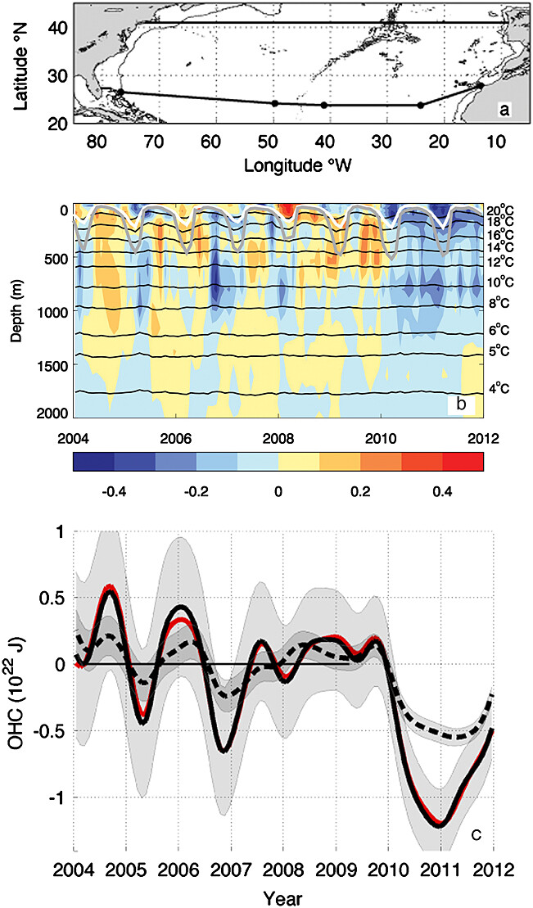

(a) Measurement locations and region of interest. Bathymetry (0 and 2000 m contours) and topography (grey) of the North Atlantic region with the northern and southern limits of the volume shown by black lines at 26.5°N and 41°N. At 26.5°N, the Florida cable is given by the short segment between Florida and the Bahamas, and the principal RAPID 26.5°N array mooring positions are indicated by dots. (b) Area-averaged subsurface temperature anomalies in the subtropical North Atlantic (5–82°W, 26.5–41°N) calculated relative to the 1991–2010 seasonal cycle using monthly means from the EN3 v2a gridded objective analysis of quality-controlled subsurface temperature observations [Ingleby and Huddleston, 2007], (http://www.metoffice.gov.uk/hadobs/en3/). Black lines indicate the area-averaged depth of selected isotherms across the same region. Mean mixed layer depth (white) and the 95th percentile (grey) for which only 5% of grid boxes have a deeper mixed layer defined by Kara et al. [2000]. The MLD is the depth over which air-sea exchanges drive turbulent mixing of the ocean. (c) Six month low-pass filtered ocean heat content anomalies relative to 1991–2010 above 2000 m (solid black), above the 4°C isotherm (red) and above the 14°C isotherm (dashed black). OHC uncertainties (grey) are generated by model-based estimates associated with changes in sampling density and locations and are for 10 day values. They are approximated by the OHC uncertainties shallower than 2000 m and 500 m respectively (section S3).