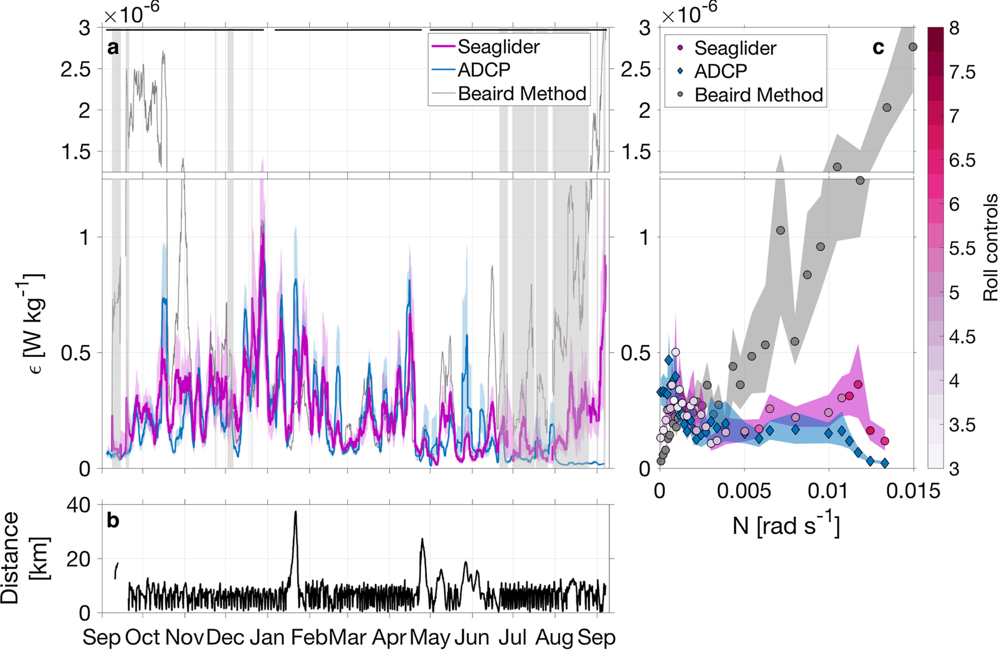

Seaglider-based rate of dissipation (magenta) compared to dissipation rate estimated using the ADCP-based structure function approach (blue) and the original Beaird et al. (2012) method to estimate dissipation from glider observations using a fixed 30 m high-pass filter (gray). Time series are smoothed using a 4-day running mean. The colored shading shows the 90% confidence interval determined using a Monte Carlo approach. The gray shading indicates periods of excessive glider roll maneuvers. An estimate of glider-based dissipation rate is flagged when the number of roll maneuvers in a given 20 m depth bin exceeds 6. The gray shading indicates periods in which more than half the data used to calculate the 4-day average is flagged. The horizontal black bars denote individual glider deployments. (b) Distance between the Seaglider and the ADCP. (c) Seaglider- and ADCP-based dissipation rates averaged into bins of buoyancy frequency, N. Each N-bin contains 100 glider observations. The color of the glider data points indicates the mean number of glider roll maneuvers. The colored shading shows the 90% confidence interval determined using a Monte Carlo approach. ADCP = acoustic Doppler current profiler.