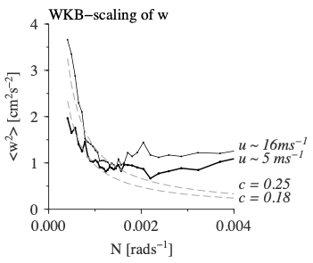
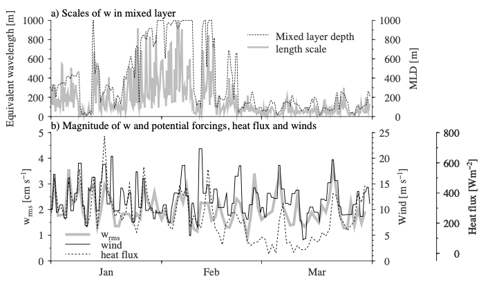

Figure 5.18: WKB-scaling of wrms in the stratified ocean, sg015. Vertical velocity measurements were binned by N and wind speed (either > 10 m s−1 or < 10 m s−1). Winds in these two bands averaged 5 and 16 m s−1. For N < 0.0013 rad s−1, measurements matched theoretical expectations for a GM-internal wave field, scaling as < w2 >≈ 0.25N0/N. The WKB-scaling breaks for N > 0.0013 rad s−1. A weak dependence of the coefficient cGM on winds was found, though 95% confidence intervals overlap. cGM ≈ 0.18 for weaker winds and 0.25 for higher winds.

Figure 5.20: Scales and magnitude of vertical velocities in the surface mixed layer from sg015, January through March, 2005. a) Decorrelation length scale of vertical velocities in the mixed layer and the mixed layer depth. Notably, the length scales appear to correlate with mixed layer depths, with a ratio of about L = 0.27 MLD. b) Magnitude of vertical velocities in the surface mixed layer estimated as wrms in 1-daily periods corresponding to the daily period of the heat fluxes and winds from Yu and Weller 2007. Wind speeds and heat fluxes are also shown.