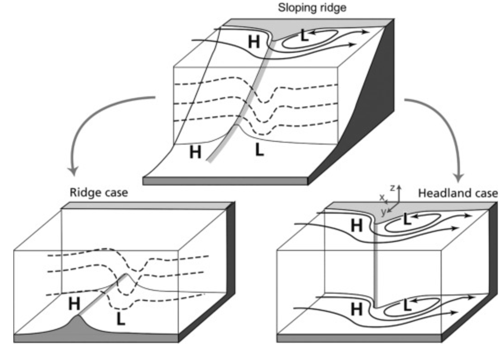

Fig. 1. Examples of varying topography including a sloping ridge, subsurface ridge and headland. Here the H and L indicate regions of high and low pressure, respectively. In the ridge case (lower left), isopycnals are dashed indicating the presence of lee waves. In the headland case (lower right), a lee eddy is shown to the right of the topography. In the sloping ridge (top), a combination of both processes is occurring.

Reproduced from S. J. Warner, P. MacCready (2009). Dissecting the pressure field in tidal flow past a headland: When is form drag “real”? Journal of Physical Oceanography 39, 2971–2984. https://doi.org/10.1175/2009JPO4173.1.