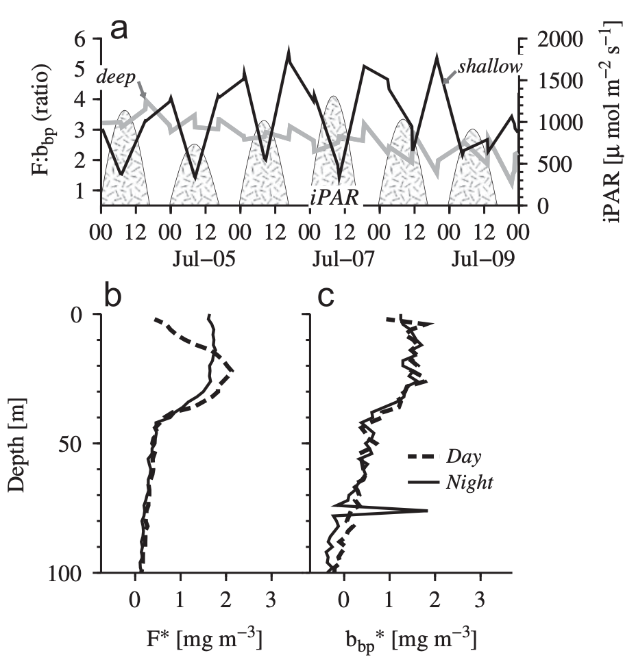
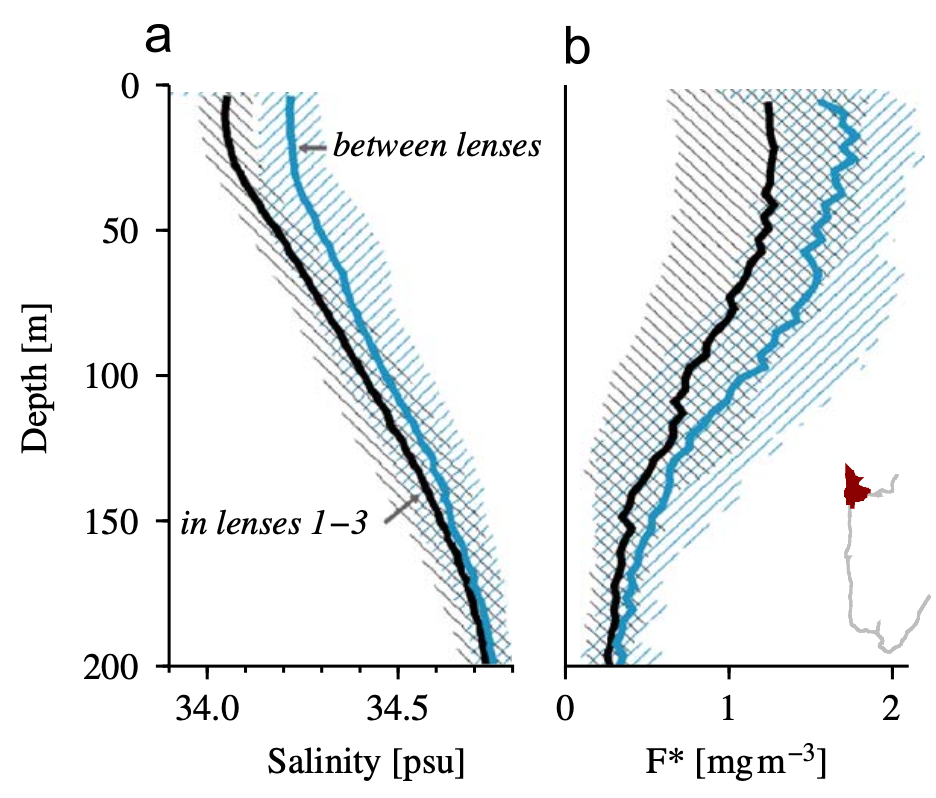

Figure 4. **Fluorescence quenching** (a) Near-surface (0–10 m, black line) and deeper (20–30 m, gray
line) values of fluorescence-to-backscatter ratio F : bbp , and SeaWiFS
iPAR (instantaneous incident light, hatched regions, described in
Section 2) for July 4–9, 2005. Lower surface F : bbp ratios are observed
during the day (higher iPAR), indicative of fluorescence quenching.
(b) Day and night vertical profiles of F and bbp show the depth range
over which fluorescence is quenched (0–30 m), while bbp is relatively
constant in the surface layer.

Figure 12. **Chlorophyll within and between fresh lenses.** Mean vertical profiles of (a) salinity and (b) fluorescence bloom
intensity inside (black) and at the edges of (blue-gray) lenses 1–3 in the
north region. Lower salinities are in the lenses by definition, while higher
average F values are at the edges of the lenses. Shaded regions around
the profiles indicate one standard deviation. (For interpretation of the
references to color in this figure legend, the reader is referred to the web
version of this article.)