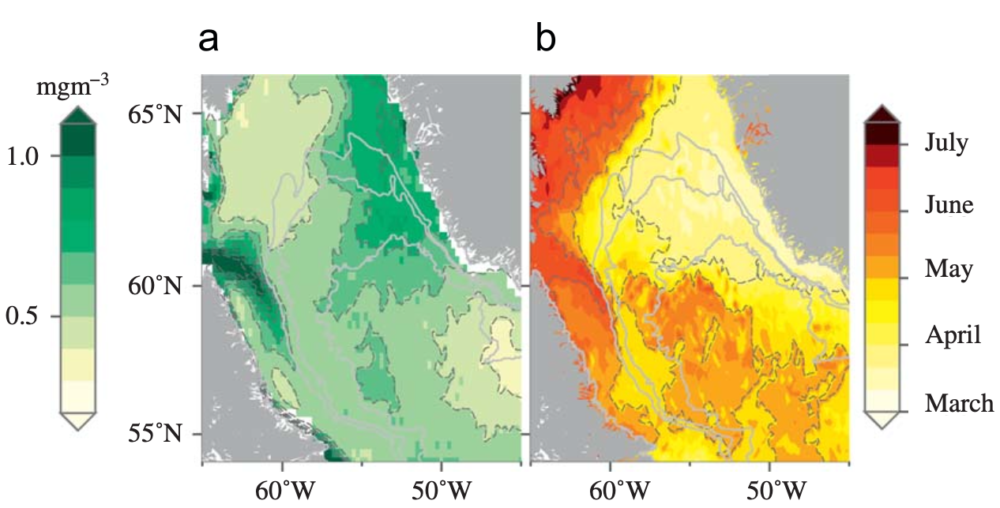

(a) Mean chlorophyll and (b) median start day of the bloom, from 1998 to 2008. High mean chlorophyll regions (a) include the plume exiting the Hudson strait at
601N and 651W, and the dual-lobed feature off the coast of west Greenland, at 631N and 571W and 611N and 551W. Note that the Labrador Sea north of 601N blooms
early, the Labrador shelves and Hudson outflow bloom late, while the central Labrador Sea is intermediate in both magnitude and timing.)