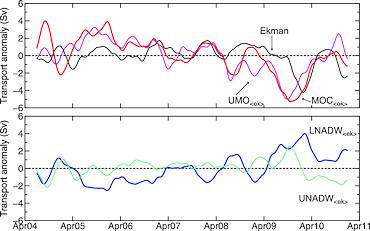

(top) Transport anomaly time series after removing the average seasonal cycle (calculated over the full timeseries) and smoothing with a 180-day low-pass Tukey filter. Components include Ekman (black), upper mid-ocean with fixed Ekman (magenta) and overturning with fixed Ekman (red). Transports in units of Sverdrups. (bottom) Transport time series with the average seasonal cycle removed of the upper NADW (1100–3000 m, cyan) and lower NADW (3000–5000 m, dark blue), calculated with fixed Ekman. These are the main water masses of the deep mid-ocean transports