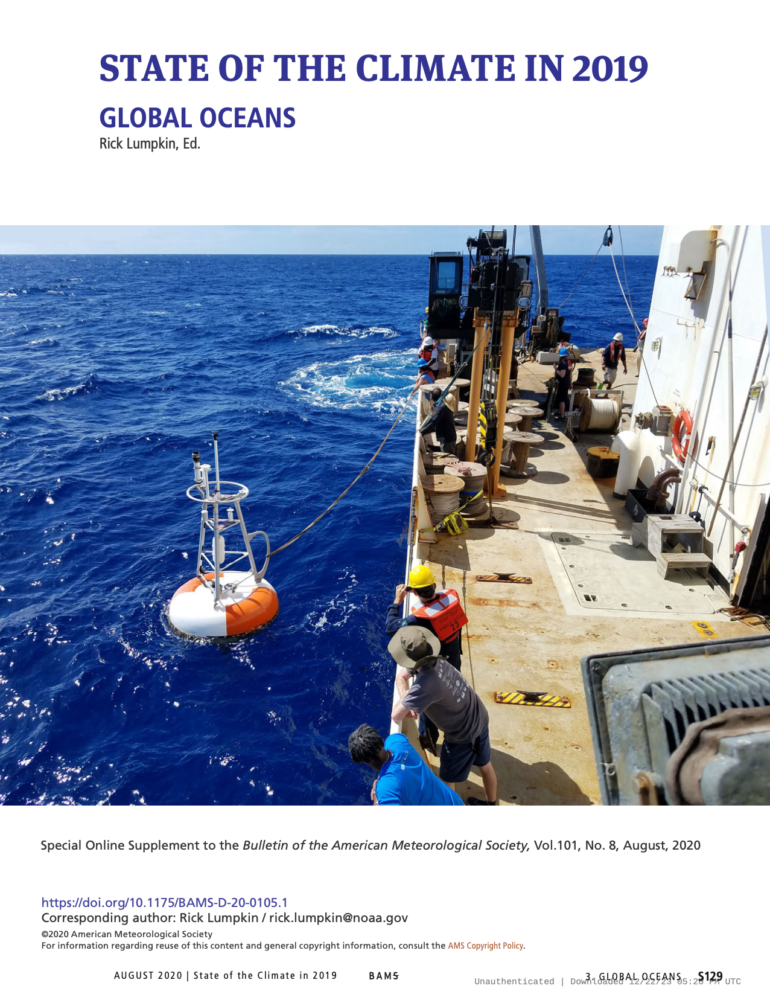

Estimates of the northward MOC and MHT transports: (a)
across OSNAP array, (b) at 26.5°N, and (c) at 34.5°S. Gray curves show
12-hourly values for RAPID/MOCHA/WBTS in (b) and daily values for
SAMBA in (c); black curves show MOC monthly values. The blue lines
show averages during 2004–08 and 2008–12 in panel (b) and linear
trends in 2009–10 and 2013–17 in panel (c). MHT estimates are shown
by red curves for OSNAP and RAPID/MOCHA/WBTS arrays. The green
curve in (b) shows the MOC estimate at 26.5°N from the combination
of altimetry and Argo data. The blue/red crosses in (c) show MOC/
MHT estimates obtained from XBT data along AX18 transect in the
South Atlantic.