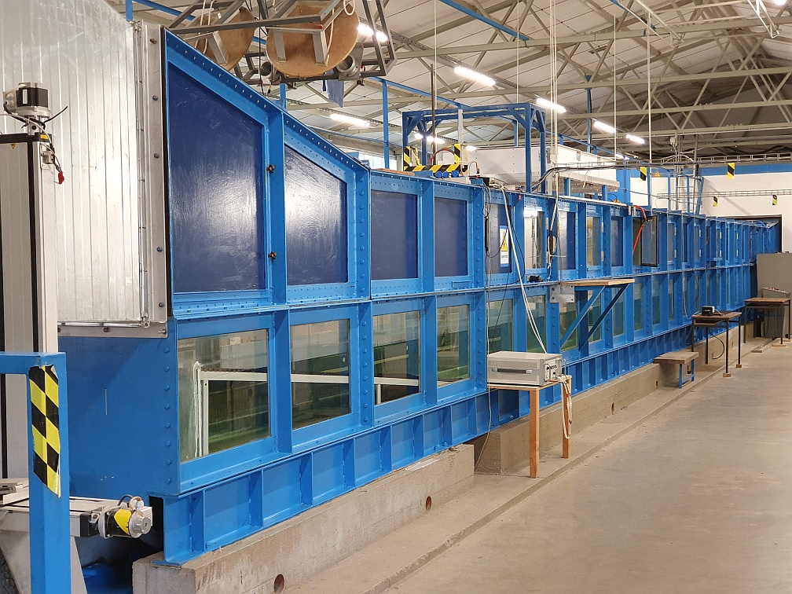

At Universität Hamburg's wind-wave tank, basic research is perfomed on air-sea interactions and their remote sensing. Fluxes of energy, momentum, gas and heat, along with the underlying small-scale processes, can be varied and studied. Frequent experimental campaigns are performed aid in the development of new theories on air-sea interactions and on the radar remote sensing of wind-roughended sea surfaces.

See more details at the [wind-wave wiki (external)](https://wiki.cen.uni-hamburg.de/ifm/KFEW3O/WWK).